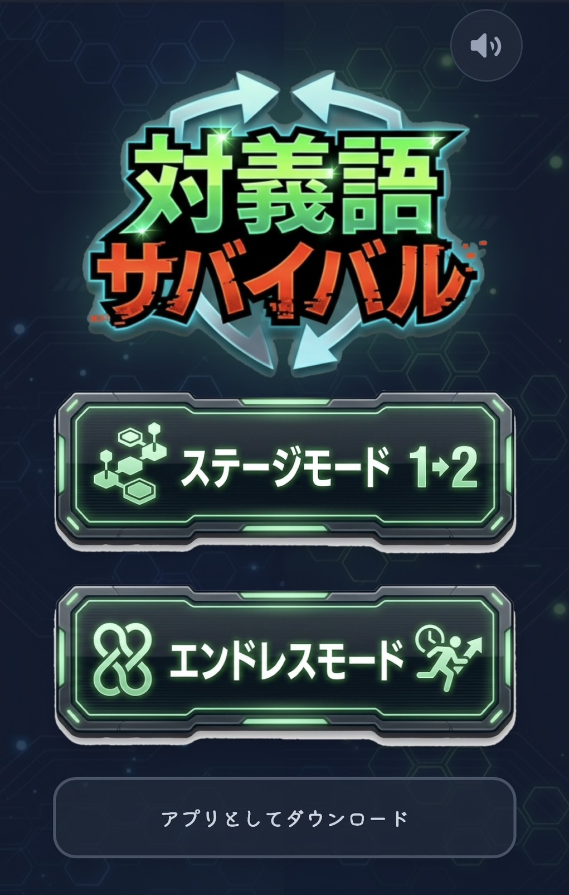
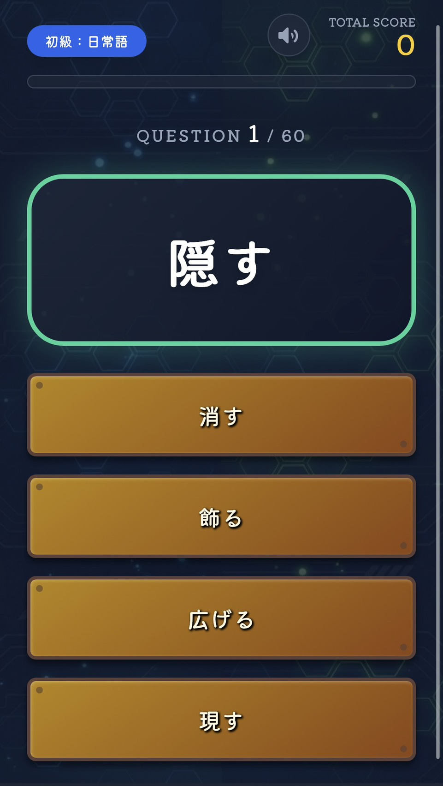
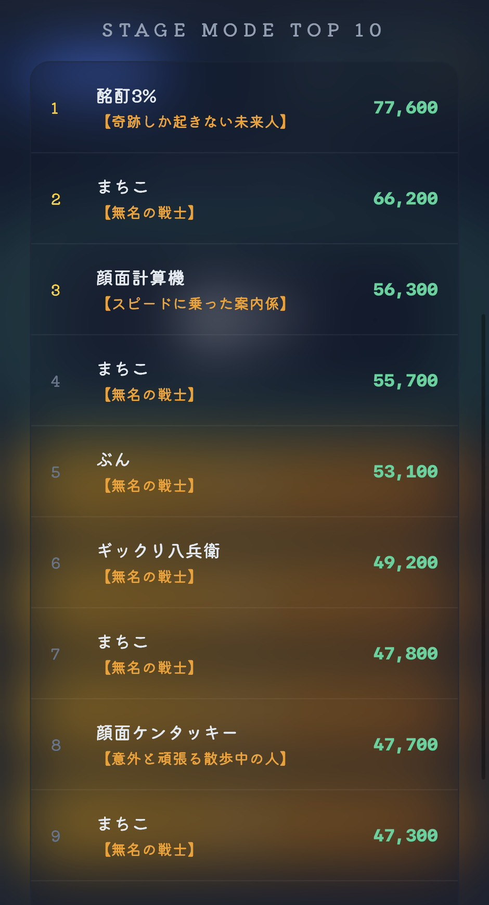

# ⚡️ 対義語サバイバル (Antonym Survival)

[](https://opensource.org/licenses/MIT)


**「言葉の裏側を、瞬時に見抜け。」**

瞬発力と語彙力が試される、究極の対義語クイズサバイバル。  
初級から「地獄級」まで、全200問の難関を突破し、全国ランキングの頂点を目指せ。

---

## 🎮 ゲームの特徴

- **4つの難易度階層**: 
    - 🟢 **初級 (Elementary)**: 日常的な基本語彙
    - 🟡 **中級 (Intermediate)**: 社会生活で使われる語彙
    - 🔴 **上級 (Advanced)**: 抽象概念や難読熟語
    - 🔥 **地獄級 (Hell)**: 業界用語・専門知識・マニアックな対比
- **サバイバルシステム**: 制限時間内に正解し続け、ハイスコアを叩き出せ。
- **全国ランキング**: スコアを登録して、全国の猛者と競い合うことが可能。
- **PWA対応**: ホーム画面に追加して、アプリ感覚でいつでもプレイ。

## 🚀 クイックスタート

1. このリポジトリをクローンまたはダウンロードします。
2. `index.html` をブラウザで開くだけでプレイ可能です。

```bash
git clone [https://github.com/](https://github.com/)bbbb555/antonym-survival.git
## 📸 スクリーンショット

| ホーム画面 | プレイ画面 | ランキング |
| :--- | :--- | :--- |
|  |  |  |

> ※ `img/` フォルダを作成し、そこに `home.png`, `play.png`, `rank.png` という名前でスクリーンショットを保存してください。

## 📜 ライセンス

このプロジェクトは [MITライセンス](LICENSE) のもとで公開されています。

---
Created by **B** & **S**
